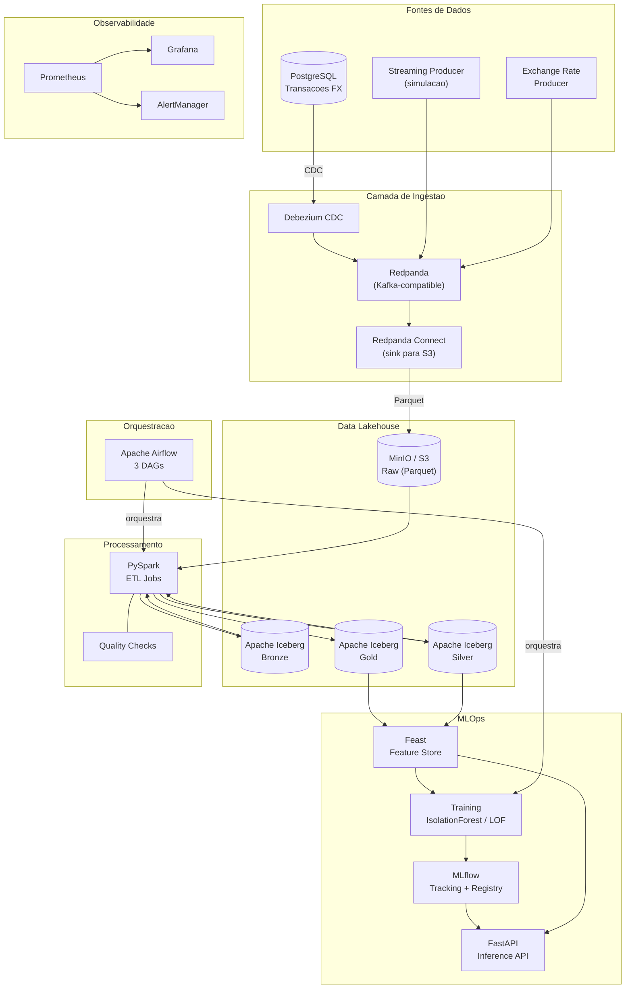
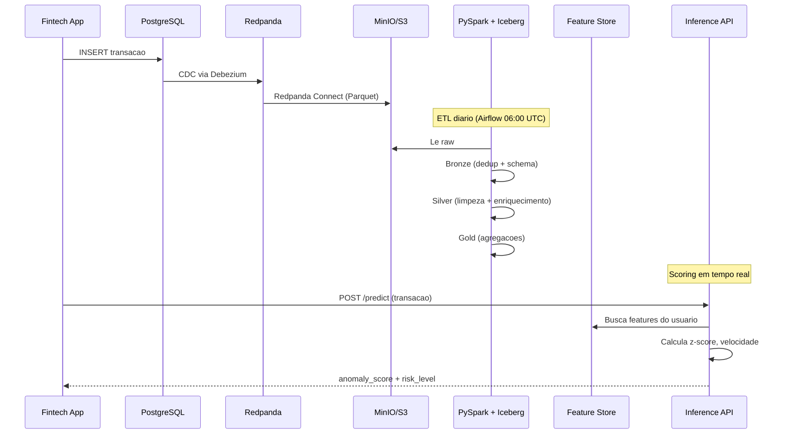
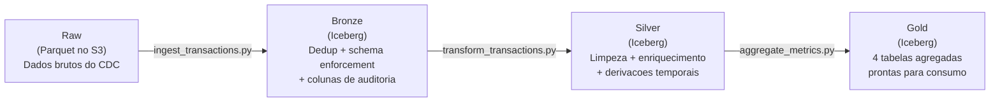
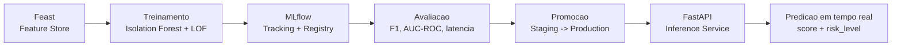

# FX Data Platform

[](https://github.com/gdseabra/fx-data-platform/actions/workflows/python-ci.yml)
[](https://github.com/gdseabra/fx-data-platform/actions/workflows/spark-tests.yml)
[](https://github.com/gdseabra/fx-data-platform/actions/workflows/terraform-ci.yml)

Plataforma de dados de producao para processamento de transacoes de cambio (FX) em tempo real com deteccao de anomalias via Machine Learning. O projeto implementa um **Data Lakehouse** completo com ingestao streaming, ETL em camadas (Bronze/Silver/Gold), feature store, treinamento de modelos e inferencia em tempo real — orquestrado por Airflow e monitorado por Prometheus + Grafana.

---

## O problema que resolve

Fintechs de cambio processam milhares de transacoes por dia. Cada transacao precisa ser:

1. **Capturada em tempo real** do banco transacional via CDC (Change Data Capture)
2. **Transformada** em camadas progressivas de qualidade (raw -> bronze -> silver -> gold)
3. **Analisada** por modelos de ML para detectar transacoes anomalas (fraude, erros, lavagem)
4. **Monitorada** com dashboards operacionais e alertas automaticos

Esta plataforma implementa todo esse pipeline end-to-end, do dado bruto ate o score de anomalia em tempo real.

---

## Arquitetura



### Fluxo de dados



---

## Stack tecnologica

| Camada | Tecnologia | Funcao |
|--------|-----------|--------|
| **Banco de dados** | PostgreSQL 15 | Banco transacional fonte (simulado) |
| **Streaming** | Redpanda | Plataforma de eventos Kafka-compatible |
| **CDC** | Debezium | Change Data Capture do PostgreSQL |
| **Stream Processing** | Redpanda Connect | Sink de eventos para S3/MinIO |
| **Object Storage** | MinIO (dev) / S3 (prod) | Data Lake (camadas raw/bronze/silver/gold) |
| **Table Format** | Apache Iceberg | ACID transactions, time travel, schema evolution |
| **ETL** | PySpark 3.5 | Transformacoes distribuidas |
| **Orquestracao** | Apache Airflow | 3 DAGs (ETL diario, monitor streaming, ML semanal) |
| **Feature Store** | Feast | Features consistentes entre training e serving |
| **ML Tracking** | MLflow | Experimentos, model registry, artefatos |
| **ML Models** | scikit-learn | Isolation Forest + LOF (deteccao de anomalias) |
| **Inference API** | FastAPI | Scoring em tempo real (target: p95 < 100ms) |
| **IaC** | Terraform | Modulos AWS (S3, IAM, Glue) |
| **CI/CD** | GitHub Actions | 4 workflows (Python CI, Spark tests, Terraform CI/CD) |
| **Metricas** | Prometheus | Coleta de metricas de todos os servicos |
| **Dashboards** | Grafana | Pipeline Overview + Cost Tracking |
| **Alertas** | AlertManager | Routing para Slack, Email, PagerDuty |
| **Logging** | structlog | Logs estruturados (JSON) |
| **Testes** | pytest | Unit + integration (coverage minimo 80%) |
| **Linting** | ruff + black + mypy | Formatacao, linting, type checking |

---

## Estrutura do projeto

```
fx-data-platform/
├── ingestion/                     # Ingestao em tempo real
│   ├── producer/                  #   Produtores Kafka (transacoes + taxas de cambio)
│   ├── consumer/                  #   Consumer de health check
│   ├── debezium/                  #   Configuracao CDC PostgreSQL
│   ├── redpanda-connect/          #   Pipeline de sink para S3
│   └── schemas/                   #   JSON Schemas de validacao
│
├── etl/                           # Jobs PySpark
│   ├── jobs/
│   │   ├── bronze/                #   Raw -> Bronze (dedup, schema enforcement)
│   │   ├── silver/                #   Bronze -> Silver (limpeza, enriquecimento)
│   │   └── gold/                  #   Silver -> Gold (agregacoes, metricas)
│   ├── common/                    #   SparkSession factory, schemas, quality checks
│   └── iceberg/                   #   Setup de catalogo, manutencao, time travel
│
├── orchestration/                 # Apache Airflow
│   ├── dags/                      #   3 DAGs: ETL diario, monitor, ML pipeline
│   └── plugins/                   #   Operators customizados + callbacks de alerta
│
├── ml/                            # Machine Learning
│   ├── feature_store/             #   Feast: definicoes, data sources, materializacao
│   ├── training/                  #   Pipeline: treino -> avaliacao -> promocao
│   ├── serving/                   #   FastAPI inference + model hot-reload + Dockerfile
│   ├── config/                    #   Hiperparametros e thresholds
│   └── notebooks/                 #   EDA e exploracao
│
├── monitoring/                    # Observabilidade
│   ├── prometheus/                #   Scrape configs + regras de alerta (10 regras)
│   ├── grafana/                   #   Dashboards (Pipeline Overview + Cost Tracking)
│   └── alertas/                   #   AlertManager (Slack, Email, PagerDuty)
│
├── scripts/ops/                   # Automacao operacional
│   ├── health_check.py            #   Verifica 9 servicos com output colorido
│   ├── reprocess_partition.py     #   Reprocessa particoes por camada e data range
│   ├── data_quality_report.py     #   Gera relatorio HTML de qualidade dos dados
│   ├── cleanup_orphan_files.py    #   Remove arquivos orfaos do S3/MinIO
│   ├── rotate_secrets.py          #   Rotacao de credenciais (placeholder)
│   └── generate_runbook.py        #   Gera runbook markdown a partir dos alertas
│
├── infra/terraform/               # IaC para AWS
│   └── modules/                   #   S3 (5 buckets), IAM (3 roles), Glue (catalog)
│
├── tests/                         # Suite de testes
│   ├── etl/                       #   16+ testes de quality checks, schemas, jobs
│   ├── ingestion/                 #   Testes de producer, schemas, integracao
│   ├── orchestration/             #   Validacao de DAGs (import, schedule, tasks)
│   └── ml/                        #   Testes de training pipeline
│
├── docs/                          # Documentacao completa
│   ├── architecture.md            #   Diagramas Mermaid + 4 ADRs
│   ├── runbook.md                 #   8 cenarios de incidente com diagnostico
│   ├── onboarding.md              #   Setup do zero ate pipeline rodando
│   ├── data_catalog.md            #   Schemas, linhagem, SLAs, consumers
│   └── monitoring_guide.md        #   Dashboards, alertas, queries PromQL
│
├── docker-compose.yml             # 11+ servicos para dev local
├── docker-compose.monitoring.yml  # Prometheus + Grafana + AlertManager
├── Dockerfile.airflow             # Imagem customizada do Airflow
├── Makefile                       # 20+ comandos (setup, test, etl, monitoring)
├── pyproject.toml                 # Dependencias e configs (black, ruff, mypy, pytest)
└── conf/spark-defaults.conf       # Configuracao do Spark para Iceberg + S3
```

---

## Quick Start

### Pre-requisitos

- **Docker Desktop** (4GB+ RAM alocados)
- **Python 3.10+** com **Conda** (Miniconda)
- **Git**

### 1. Clone e instale

```bash
git clone https://github.com/gdseabra/fx-data-platform.git
cd fx-data-platform

# Criar env conda (usado pelo Spark)
conda create -n nomad python=3.11 -y
conda activate nomad

# Instalar dependencias
make setup
```

### 2. Suba os servicos

```bash
# Inicia PostgreSQL, Redpanda, MinIO, Airflow, MLflow, Inference API, etc.
make docker-up

# Aguardar ~30s para inicializacao
make health-check
# Expected: 9/9 services healthy

# Popular banco com dados de teste
make seed
```

### 3. Rode o pipeline ETL

```bash
# Gerar dados de streaming (100 msgs/s por 60 segundos)
python -m ingestion.producer.streaming_producer --rate 100 --duration 60 --anomalies

# Criar tabelas Iceberg + rodar Bronze -> Silver -> Gold
make etl-all
```

### 4. Acesse os servicos

| Servico | URL | Credenciais |
|---------|-----|-------------|
| Redpanda Console | http://localhost:8080 | — |
| MinIO Console | http://localhost:9001 | minioadmin / minioadmin |
| Airflow | http://localhost:8090 | admin / admin |
| MLflow | http://localhost:5000 | — |
| Inference API (Swagger) | http://localhost:8000/docs | — |
| Prometheus | http://localhost:9090 | — (apos `make monitoring-up`) |
| Grafana | http://localhost:3000 | admin / admin (apos `make monitoring-up`) |

---

## Camadas do Data Lakehouse



| Camada | Tabela | Descricao | Particionamento |
|--------|--------|-----------|-----------------|
| Bronze | `bronze.transactions` | Dados deduplicados com schema enforced | `days(timestamp)` |
| Silver | `silver.transactions` | Dados limpos, enriquecidos com features temporais | `days(event_date)` + `bucket(16, currency)` |
| Gold | `gold.daily_volume` | Volume diario por moeda + media movel 7d | `days(event_date)` |
| Gold | `gold.user_summary` | Resumo lifetime por usuario | — |
| Gold | `gold.hourly_rates` | Taxa de cambio media por hora | `days(hour_bucket)` |
| Gold | `gold.anomaly_summary` | Contagem de anomalias por dia | `days(event_date)` |

---

## Deteccao de Anomalias (ML)

O modelo de deteccao de anomalias usa **Isolation Forest** (algoritmo nao-supervisionado) para identificar transacoes suspeitas em tempo real.

### Pipeline de ML



### Features utilizadas

| Feature | Tipo | Descricao |
|---------|------|-----------|
| `amount_brl` | Numerica | Valor da transacao em Reais |
| `hour_of_day` | Numerica | Hora da transacao (0-23) |
| `day_of_week` | Numerica | Dia da semana (1-7) |
| `is_business_hours` | Booleana | Horario comercial (9h-17h) |
| `spread_pct` | Numerica | Spread percentual cobrado |
| `z_score_amount` | On-demand | Z-score do valor vs media do usuario |
| `velocity_score` | On-demand | Transacoes/hora recente do usuario |

### Criterios de promocao

O modelo so e promovido para producao se:
- F1 Score > 0.85
- Precision > 0.80
- Recall > 0.75
- Latencia p95 < 50ms
- Nao piora em relacao ao modelo atual

---

## Airflow DAGs

| DAG | Schedule | Funcao |
|-----|----------|--------|
| `dag_daily_etl` | Diario 06:00 UTC | Pipeline completo: sensor -> bronze -> quality -> silver -> quality -> gold -> iceberg maintenance |
| `dag_streaming_monitor` | A cada 15 min | Verifica: consumer lag, connector status, data freshness |
| `dag_ml_pipeline` | Semanal (seg 08:00 UTC) | Feature materialization -> training -> validation -> deployment |

---

## Observabilidade

### Dashboards Grafana

**Pipeline Overview** — 4 grupos de paineis:
- **Pipeline Health**: Status UP/DOWN de 6 servicos, tempo desde ultimo ETL, SLA compliance
- **Streaming Metrics**: msgs/seg por topico, consumer lag, tamanho de particoes, taxa de erro
- **Data Quality**: freshness por camada, contagem de registros, quality check pass rate
- **ML Model Performance**: latencia p50/p95/p99, score distribution, PSI drift, F1 ao longo do tempo

**Cost Tracking** — Estimativas de custo por servico:
- Storage S3 por camada (USD/mes)
- Duracao e custo estimado EMR/Glue por job
- Throughput e retencao Redpanda

### Alertas configurados

| Alerta | Severidade | Threshold |
|--------|-----------|-----------|
| `HighConsumerLag` | CRITICAL | lag > 10k por 5min |
| `NoDataIngestion` | CRITICAL | sem dados > 1h |
| `InferenceServiceCritical` | CRITICAL | down ou p95 > 500ms |
| `DataDriftDetected` | WARNING | PSI > 0.2 |
| `ModelStaleness` | WARNING | > 30 dias sem retreino |
| `DataQualityDegraded` | WARNING | > 5% registros falhando |
| `LowTransactionVolume` | INFO | 50% abaixo da media |

Routing: CRITICAL -> PagerDuty + Slack | WARNING -> Slack + Email | INFO -> Slack

---

## Infraestrutura (Terraform)

Modulos AWS para deploy em producao:

| Modulo | Recursos |
|--------|----------|
| `modules/s3` | 5 buckets (raw, bronze, silver, gold, ml) com versionamento, encryption, lifecycle |
| `modules/iam` | 3 roles (Glue, EMR, Lambda) com least privilege |
| `modules/glue` | Glue Catalog databases + crawlers |

```bash
cd infra/terraform
terraform init
terraform plan -var-file=environments/dev/terraform.tfvars
terraform apply
```

---

## Testes

```bash
make test              # Todos os testes com coverage (minimo 80%)
make test-unit         # Apenas unitarios (rapido)
make test-integration  # Apenas integracao (requer Docker)
make lint              # ruff + mypy
make format            # black + isort
```

Suite de testes cobre:
- **ETL**: Quality checks (16+ testes), validacao de schemas, deduplicacao, transformacoes
- **Ingestion**: Serializacao, producer, schemas, integracao streaming
- **Orchestration**: Import de DAGs, schedules, dependencias entre tasks, retries
- **ML**: Pipeline de treinamento

---

## Comandos uteis

```bash
# Desenvolvimento
make setup              # Instalar dependencias
make format             # Formatar codigo (black + isort)
make lint               # Linters (ruff + mypy)
make test               # Rodar testes com coverage
make clean              # Remover artefatos de build

# Docker
make docker-up          # Subir todos os servicos
make docker-down        # Parar servicos
make logs               # Ver logs
make seed               # Popular banco com dados de teste
make reset              # Destruir volumes e recriar

# ETL (Spark + Iceberg)
make etl-setup          # Criar catalogo e tabelas Iceberg
make etl-bronze         # Rodar Bronze
make etl-silver         # Rodar Silver
make etl-gold           # Rodar Gold
make etl-all            # Pipeline completo

# Monitoring
make monitoring-up      # Subir Prometheus + Grafana + AlertManager
make monitoring-down    # Parar monitoring
make health-check       # Verificar saude de 9 servicos
```

---

## Documentacao

| Documento | Descricao |
|-----------|-----------|
| [architecture.md](docs/architecture.md) | Diagramas Mermaid, fluxo end-to-end, 4 ADRs (Redpanda vs Kafka, Iceberg vs Delta, Feast, Isolation Forest) |
| [runbook.md](docs/runbook.md) | 8 cenarios de incidente com diagnostico, resolucao e prevencao |
| [onboarding.md](docs/onboarding.md) | Setup do zero, como criar jobs ETL, features, treinar modelos |
| [data_catalog.md](docs/data_catalog.md) | Schemas completos com linhagem, SLAs de freshness, consumers por team |
| [monitoring_guide.md](docs/monitoring_guide.md) | Como usar dashboards, interpretar alertas, queries PromQL |

---

## Decisoes arquiteturais

| Decisao | Alternativa | Por que |
|---------|-------------|---------|
| **Redpanda** vs Kafka | Kafka | 10x menos memoria, zero JVM, 100% Kafka-compatible, single binary |
| **Iceberg** vs Delta Lake | Delta Lake | Hidden partitioning, vendor-neutral, time travel nativo, melhor schema evolution |
| **Feast** vs custom | Tecton, Hopsworks | Open source, online/offline consistency, point-in-time joins, on-demand features |
| **Isolation Forest** vs Deep Learning | Autoencoder, LSTM | Nao precisa de labels, <1ms inferencia, interpretavel, ideal para dados tabulares |

Detalhes completos em [docs/architecture.md](docs/architecture.md).

---

## Licenca

MIT License — veja [LICENSE](LICENSE).

---

**Autor:** [Gabriel Seabra](https://github.com/gdseabra)
