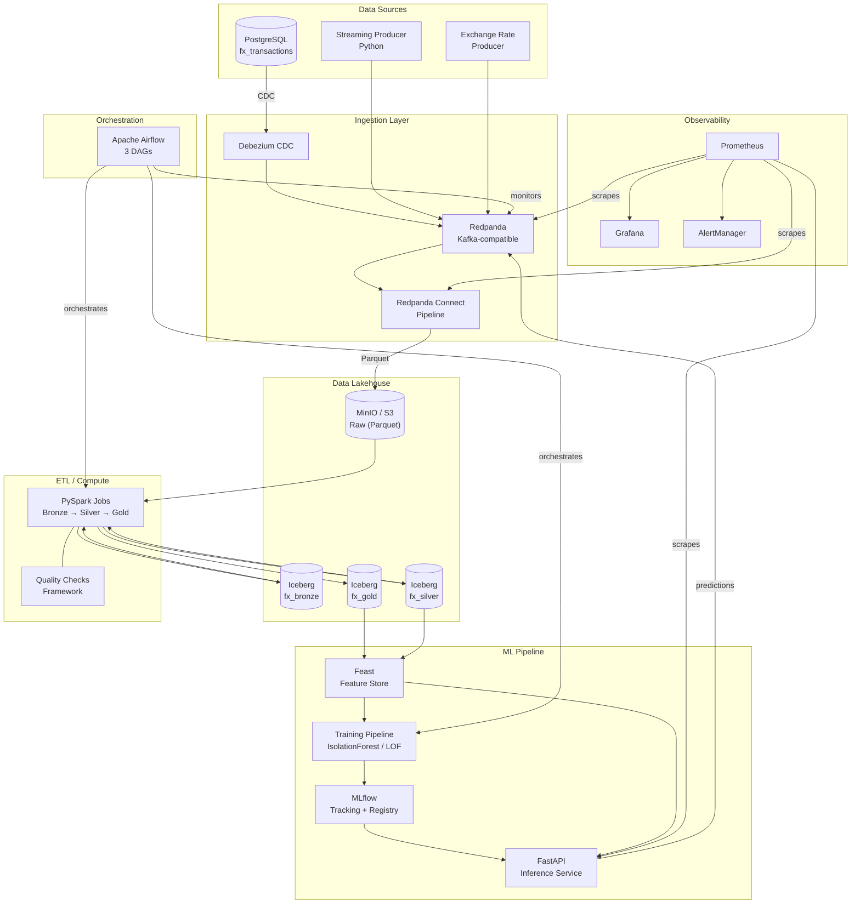
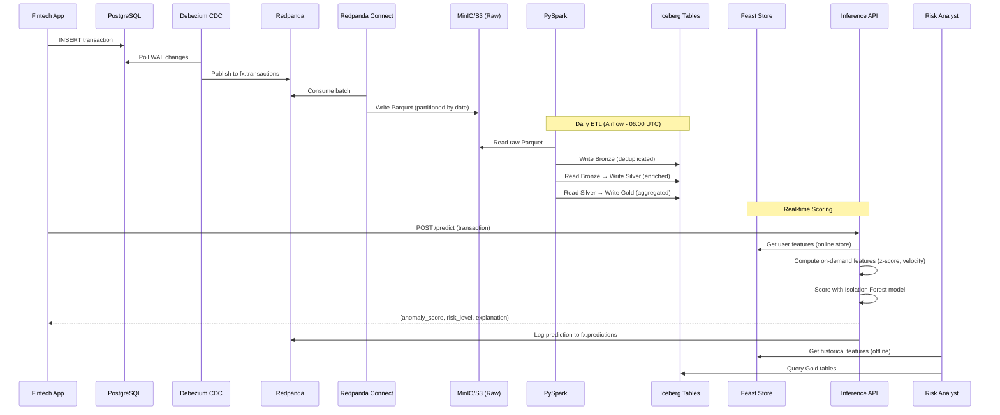

# FX Data Platform — Architecture Documentation

## System Architecture

## Data Flow End-to-End

## Component Descriptions

| Component | Purpose | Port | Technology |
|-----------|---------|------|------------|
| PostgreSQL | Transactional source database | 5434 | PostgreSQL 15 |
| Redpanda | Event streaming (Kafka-compatible) | 9092 | Redpanda |
| Redpanda Console | Topic browser UI | 8080 | Redpanda Console |
| Redpanda Connect | Stream processing pipeline | 4195 | Redpanda Connect (Benthos) |
| MinIO | S3-compatible object storage | 9000/9001 | MinIO |
| Airflow | Workflow orchestration | 8090 | Apache Airflow 2.10 |
| MLflow | ML experiment tracking & model registry | 5000 | MLflow |
| Inference Service | Real-time anomaly scoring | 8000 | FastAPI + scikit-learn |
| Prometheus | Metrics collection | 9090 | Prometheus |
| Grafana | Dashboards & visualization | 3000 | Grafana |
| AlertManager | Alert routing & notification | 9093 | Prometheus AlertManager |

## Architectural Decision Records (ADRs)

### ADR-1: Redpanda instead of Apache Kafka

**Context:** We need a distributed streaming platform for CDC events and real-time transaction data.

**Decision:** Use Redpanda.

**Rationale:**
- **10x lower memory footprint** — Redpanda uses ~100MB vs Kafka's 1GB+ per broker for similar workloads. Critical for local dev and cost in prod.
- **Zero JVM dependency** — Single C++ binary eliminates JVM tuning, GC pauses, and ZooKeeper (KRaft still maturing in Kafka).
- **100% Kafka API compatible** — All existing Kafka clients, connectors (Debezium), and tools work without changes.
- **Built-in Schema Registry** — No need to deploy Confluent Schema Registry separately.
- **Simpler operations** — No ZooKeeper, no controller election issues, auto-tuning for partition balancing.

**Trade-offs:**
- Smaller community than Kafka (but growing rapidly).
- Some advanced Kafka Streams features may have edge-case differences.
- Redpanda Cloud pricing vs self-managed Kafka on EC2.

### ADR-2: Apache Iceberg instead of Delta Lake

**Context:** We need a table format for the data lakehouse that supports ACID, schema evolution, and time travel.

**Decision:** Use Apache Iceberg.

**Rationale:**
- **Hidden partitioning** — Users query `WHERE date = '2024-03-15'` without knowing the physical partition layout. Iceberg translates to partition pruning automatically. Delta Lake requires explicit `PARTITIONED BY`.
- **Schema evolution** — Add/rename/drop columns without rewriting data files. Iceberg uses a metadata-only operation.
- **Time travel** — Query any historical snapshot by ID or timestamp for audit and rollback. `SELECT * FROM table VERSION AS OF <snapshot-id>`.
- **Vendor-neutral** — Works with Spark, Flink, Trino, Dremio, Snowflake. Not tied to Databricks ecosystem.
- **Better compaction** — Built-in `rewrite_data_files` and `expire_snapshots` for storage optimization.

**Trade-offs:**
- Delta Lake has deeper Databricks integration (if using Databricks).
- Delta Lake's `MERGE INTO` was initially faster (Iceberg has caught up in v1.4+).
- Iceberg REST catalog is newer than Delta's Unity Catalog.

### ADR-3: Feast instead of alternatives (Tecton, Hopsworks, custom)

**Context:** We need a feature store for consistent features between training (offline) and serving (online).

**Decision:** Use Feast.

**Rationale:**
- **Open source** — No vendor lock-in, active community, extensible providers.
- **Online/Offline consistency** — Same feature definitions for batch training (`get_historical_features`) and real-time serving (`get_online_features`).
- **Sub-10ms online lookups** — DynamoDB or Redis backend for production latency requirements.
- **Point-in-time joins** — Prevents data leakage in training by correctly joining features as-of transaction timestamp.
- **On-demand features** — Compute features at request time (z_score, velocity) that can't be precomputed.

**Trade-offs:**
- Feature transformation must happen outside Feast (in Spark/ETL). Feast is a store, not a compute engine.
- Materialization must be orchestrated (we use Airflow).
- Monitoring/drift detection is basic — we supplement with custom PSI calculations.

### ADR-4: Isolation Forest instead of Deep Learning for anomaly detection

**Context:** We need to detect anomalous FX transactions in real-time with <100ms latency.

**Decision:** Use Isolation Forest (with LOF as backup).

**Rationale:**
- **No labels required** — FX fraud/anomaly labels are rare and expensive to obtain. Isolation Forest is unsupervised.
- **Sub-1ms inference** — A single prediction takes <1ms, well within our 100ms p95 budget (including feature fetch).
- **Interpretable** — Feature importance can be extracted to explain why a transaction was flagged.
- **Small model size** — ~5MB serialized model vs 100MB+ for neural networks. Fast to load and reload.
- **Proven for tabular data** — Consistently outperforms deep learning on structured/tabular anomaly detection benchmarks.

**Trade-offs:**
- Cannot capture complex temporal sequences (an autoencoder or LSTM might catch multi-step fraud patterns).
- Contamination parameter requires tuning (we use 0.05 based on domain knowledge).
- No online learning — model must be retrained periodically (weekly via Airflow DAG).

## Limitations and Known Trade-offs

1. **Single-region deployment** — Current Terraform targets us-east-1 only. Multi-region would require S3 cross-region replication and Redpanda MRC.
2. **Batch ETL latency** — Bronze→Gold pipeline runs daily. Near-real-time (micro-batch) would require Spark Structured Streaming, not yet implemented.
3. **Feast materialization gap** — Online features can be up to 30 minutes stale between materializations.
4. **No A/B testing framework** — Model promotion is all-or-nothing. Shadow mode or canary deployment would require additional infrastructure.
5. **Local dev ≠ Prod** — MinIO replaces S3, SQLite replaces DynamoDB, local Spark replaces EMR. Integration tests should run against AWS staging periodically.

---

**Related docs:**
- [Runbook](./runbook.md) — Operational procedures for incidents
- [Data Catalog](./data_catalog.md) — Table schemas and lineage
- [Onboarding](./onboarding.md) — Developer setup guide
- [Monitoring Guide](./monitoring_guide.md) — Dashboard usage and alert interpretation
