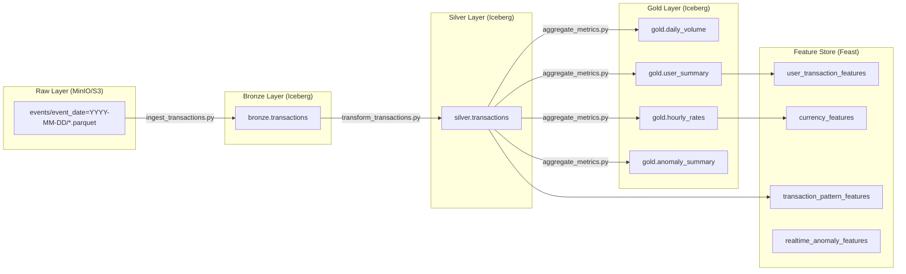

# FX Data Platform — Data Catalog

Catalogo completo de todas as tabelas, schemas, linhagem de dados, SLAs e owners.

---

## Visao Geral das Camadas



---

## Raw Layer (MinIO / S3)

**Bucket:** `fx-datalake-raw`
**Formato:** Parquet (via Redpanda Connect)
**Path:** `events/event_date=YYYY-MM-DD/<batch_id>.parquet`
**Owner:** Data Engineering
**Retention:** 90 dias (lifecycle policy move para Glacier)

Dados brutos como recebidos do Redpanda, com metadata de ingestao adicionado pelo Redpanda Connect (`ingestion_timestamp`, `source_system`, `batch_id`).

---

## Bronze Layer

### Table: `bronze.transactions`

**Processing:** `etl/jobs/bronze/ingest_transactions.py`
**Schedule:** Diario as 06:00 UTC (via `dag_daily_etl`)
**Owner:** Data Engineering
**SLA Freshness:** Atualizada ate 08:00 UTC

| Column | Type | Nullable | Description | Lineage |
|--------|------|----------|-------------|---------|
| transaction_id | STRING | No | Identificador unico da transacao | Raw: `transaction_id` |
| user_id | STRING | No | Identificador do usuario | Raw: `user_id` |
| timestamp | TIMESTAMP | No | Data/hora da transacao | Raw: `timestamp` |
| transaction_type | STRING | No | BUY ou SELL | Raw: `transaction_type` |
| currency | STRING | No | Codigo ISO 4217 (3 letras) | Raw: `currency` |
| amount_brl | DECIMAL(15,2) | No | Valor em Reais | Raw: `amount_brl` |
| amount_foreign | DECIMAL(15,4) | No | Valor na moeda estrangeira | Raw: `amount_foreign` |
| exchange_rate | DECIMAL(10,4) | No | Taxa de cambio aplicada | Raw: `exchange_rate` |
| spread_pct | DECIMAL(5,3) | No | Spread percentual | Raw: `spread_pct` |
| fee_brl | DECIMAL(10,2) | Yes | Taxa da transacao em BRL | Raw: `fee_brl` |
| status | STRING | Yes | completed / pending / failed / cancelled | Raw: `status` |
| channel | STRING | Yes | mobile / web / api | Raw: `channel` |
| device | STRING | Yes | Identificador do dispositivo | Raw: `device` |
| is_anomaly | BOOLEAN | Yes | Flag de anomalia injetada (simulacao) | Raw: `is_anomaly` |
| anomaly_score | DOUBLE | Yes | Score de anomalia (0-1) | Raw: `anomaly_score` |
| _bronze_loaded_at | TIMESTAMP | No | Timestamp de carga na Bronze | Gerado: `current_timestamp()` |
| _source_file | STRING | No | Arquivo de origem no S3 | Gerado: `input_file_name()` |
| _batch_id | STRING | No | ID do batch de processamento | Gerado: parametro do job |

**Particionamento:** `days(timestamp)`
**Deduplicacao:** Por `transaction_id`, mantendo o registro mais recente por `timestamp`
**Compressao:** Gzip (configurado via Iceberg table properties)
**Volume estimado:** ~100K-500K rows/dia

---

## Silver Layer

### Table: `silver.transactions`

**Processing:** `etl/jobs/silver/transform_transactions.py`
**Schedule:** Diario apos Bronze (via `dag_daily_etl`)
**Owner:** Data Engineering
**SLA Freshness:** Atualizada ate 09:00 UTC

| Column | Type | Nullable | Description | Lineage |
|--------|------|----------|-------------|---------|
| transaction_id | STRING | No | Identificador unico | Bronze: `transaction_id` |
| user_id | STRING | No | Identificador do usuario | Bronze: `user_id` |
| timestamp | TIMESTAMP | No | Data/hora da transacao | Bronze: `timestamp` |
| transaction_type | STRING | No | BUY ou SELL | Bronze: `transaction_type` |
| currency | STRING | No | ISO 4217 (uppercase) | Bronze: `upper(currency)` |
| amount_brl | DECIMAL(15,2) | No | Valor em Reais (> 0) | Bronze: `amount_brl` filtrado |
| amount_foreign | DECIMAL(15,4) | No | Valor na moeda estrangeira | Bronze: `amount_foreign` |
| exchange_rate | DECIMAL(10,4) | No | Taxa de cambio | Bronze: `exchange_rate` |
| spread_pct | DECIMAL(5,3) | No | Spread percentual | Bronze: `spread_pct` |
| fee_brl | DECIMAL(10,2) | Yes | Taxa em BRL | Bronze: `fee_brl` |
| status | STRING | Yes | Status da transacao | Bronze: `status` |
| channel | STRING | Yes | Canal de origem | Bronze: `channel` |
| is_anomaly | BOOLEAN | Yes | Flag de anomalia | Bronze: `is_anomaly` |
| anomaly_score | DOUBLE | Yes | Score de anomalia | Bronze: `anomaly_score` |
| amount_usd | DECIMAL(15,2) | No | Valor convertido para USD | Derivado: `amount_brl / 5.0` |
| day_of_week | INT | No | Dia da semana (1=Mon, 7=Sun) | Derivado: `dayofweek(timestamp)` |
| hour_of_day | INT | No | Hora do dia (0-23) | Derivado: `hour(timestamp)` |
| is_business_hours | BOOLEAN | No | Horario comercial (9h-17h weekdays) | Derivado: logica |
| event_date | DATE | No | Data da transacao (particao) | Derivado: `to_date(timestamp)` |
| year_month | INT | No | Formato YYYYMM | Derivado: `year*100 + month` |

**Particionamento:** `days(event_date)` + `bucket(16, currency)`
**Filtros aplicados:** `amount_brl > 0`, `currency` em lista valida (USD, EUR, GBP, JPY, AUD, CAD, CHF, CNY, MXN, ARS)
**Quality checks inline:** Null checks, range checks, currency validation (threshold 5% tolerancia)
**Volume estimado:** ~90K-480K rows/dia (apos filtros)

---

## Gold Layer

### Table: `gold.daily_volume`

**Processing:** `etl/jobs/gold/aggregate_metrics.py`
**Schedule:** Diario apos Silver
**Owner:** Analytics Team
**SLA Freshness:** Atualizada ate 09:30 UTC

| Column | Type | Description | Lineage |
|--------|------|-------------|---------|
| event_date | DATE | Data de agregacao | Silver: `event_date` |
| currency | STRING | Moeda estrangeira | Silver: `currency` |
| total_volume_brl | DECIMAL(18,2) | Soma de `amount_brl` | `SUM(silver.amount_brl)` |
| transaction_count | LONG | Total de transacoes | `COUNT(*)` |
| avg_amount | DECIMAL(15,2) | Media do valor | `AVG(silver.amount_brl)` |
| min_amount | DECIMAL(15,2) | Valor minimo | `MIN(silver.amount_brl)` |
| max_amount | DECIMAL(15,2) | Valor maximo | `MAX(silver.amount_brl)` |
| moving_avg_7d | DECIMAL(15,2) | Media movel 7 dias | Window function |
| day_over_day_change_pct | DOUBLE | Variacao dia-a-dia (%) | Window function |

**Use case:** Relatorios diarios, analise de tendencias, dashboards executivos

---

### Table: `gold.user_summary`

**Owner:** Analytics Team / Risk Team

| Column | Type | Description | Lineage |
|--------|------|-------------|---------|
| user_id | STRING | Identificador do usuario | Silver: `user_id` |
| total_transactions | LONG | Total de transacoes lifetime | `COUNT(*)` |
| total_volume_brl | DECIMAL(18,2) | Volume total em BRL | `SUM(silver.amount_brl)` |
| avg_ticket | DECIMAL(15,2) | Ticket medio | `AVG(silver.amount_brl)` |
| distinct_currencies | INT | Moedas distintas usadas | `COUNT(DISTINCT currency)` |
| first_transaction | TIMESTAMP | Primeira transacao | `MIN(silver.timestamp)` |
| last_transaction | TIMESTAMP | Ultima transacao | `MAX(silver.timestamp)` |

**Use case:** Perfil de usuario, segmentacao, deteccao de fraude

---

### Table: `gold.hourly_rates`

**Owner:** Analytics Team

| Column | Type | Description | Lineage |
|--------|------|-------------|---------|
| hour_bucket | TIMESTAMP | Hora truncada | Silver: `date_trunc('hour', timestamp)` |
| currency | STRING | Moeda | Silver: `currency` |
| avg_rate | DECIMAL(10,4) | Taxa media na hora | `AVG(silver.exchange_rate)` |
| min_rate | DECIMAL(10,4) | Taxa minima | `MIN(silver.exchange_rate)` |
| max_rate | DECIMAL(10,4) | Taxa maxima | `MAX(silver.exchange_rate)` |
| volatility | DOUBLE | Desvio padrao | `STDDEV(silver.exchange_rate)` |
| trade_count | LONG | Numero de trades | `COUNT(*)` |

**Use case:** Graficos de taxa de cambio, analise de volatilidade

---

### Table: `gold.anomaly_summary`

**Owner:** ML Team / Risk Team

| Column | Type | Description | Lineage |
|--------|------|-------------|---------|
| event_date | DATE | Data | Silver: `event_date` |
| total_transactions | LONG | Total de transacoes | `COUNT(*)` |
| anomaly_count | LONG | Transacoes anomalas | `COUNT(WHERE is_anomaly = true)` |
| anomaly_rate | DOUBLE | Taxa de anomalia (%) | `anomaly_count / total_transactions` |

**Use case:** Monitoramento de anomalias, validacao do modelo, compliance

---

## ML Features (Feast Feature Store)

**Registry:** `s3://fx-datalake-ml/feast-registry` (prod) / SQLite (dev)
**Online Store:** DynamoDB (prod) / SQLite (dev)
**Offline Store:** Parquet no S3

### Feature View: `user_transaction_features`

| Feature | Type | TTL | Source |
|---------|------|-----|--------|
| total_transactions_30d | INT64 | 1 day | gold.user_summary |
| total_volume_30d | FLOAT64 | 1 day | gold.user_summary |
| avg_ticket_30d | FLOAT64 | 1 day | gold.user_summary |
| days_since_registration | INT64 | 1 day | gold.user_summary |
| tier | STRING | 1 day | gold.user_summary |
| buy_count | INT64 | 1 day | gold.user_summary |
| sell_count | INT64 | 1 day | gold.user_summary |

### Feature View: `currency_features`

| Feature | Type | TTL | Source |
|---------|------|-----|--------|
| current_rate | FLOAT64 | 1 hour | gold.hourly_rates |
| rate_change_1h | FLOAT64 | 1 hour | gold.hourly_rates |
| rate_change_24h | FLOAT64 | 1 hour | gold.hourly_rates |
| volatility_7d | FLOAT64 | 1 hour | gold.hourly_rates |
| avg_spread | FLOAT64 | 1 hour | gold.hourly_rates |
| volume_24h | FLOAT64 | 1 hour | gold.hourly_rates |

### Feature View: `transaction_pattern_features`

| Feature | Type | TTL | Source |
|---------|------|-----|--------|
| transactions_last_1h | INT64 | 1 hour | silver.transactions |
| avg_amount_last_24h | FLOAT64 | 1 hour | silver.transactions |
| distinct_currencies_last_7d | INT64 | 1 hour | silver.transactions |
| night_transaction_ratio | FLOAT64 | 1 hour | silver.transactions |

### On-Demand Feature View: `realtime_anomaly_features`

| Feature | Type | Computation |
|---------|------|-------------|
| z_score_amount | FLOAT64 | `(amount - user_avg) / user_stddev` |
| is_unusual_hour | BOOLEAN | `hour < 6 or hour > 23` |
| velocity_score | FLOAT64 | `transactions_last_1h / avg_hourly_rate` |

---

## SLAs de Freshness

| Tabela | SLA | Verificacao | Alerta |
|--------|-----|-------------|--------|
| Raw (S3) | < 30 min atraso | `dag_streaming_monitor` (15min) | CRITICAL se > 1h |
| bronze.transactions | Ate 08:00 UTC | `dag_daily_etl` | SLA miss callback |
| silver.transactions | Ate 09:00 UTC | `dag_daily_etl` | SLA miss callback |
| gold.* | Ate 09:30 UTC | `dag_daily_etl` | SLA miss callback |
| Feast online store | < 30 min stale | `validate_features.py` | WARNING se > 1h |

---

## Data Consumers

| Team | Tabelas que acessa | Frequencia | Finalidade |
|------|-------------------|------------|------------|
| Analytics | gold.* | Ad-hoc + dashboards | Relatorios e KPIs |
| BI Team | silver.*, gold.* | Real-time dashboards | Paineis executivos |
| ML Team | silver.*, Feast features | Batch (semanal) | Training e feature engineering |
| Risk/Compliance | bronze.*, silver.* | Diaria | Auditoria e compliance |
| Product | gold.daily_volume, gold.user_summary | Semanal | Metricas de produto |

---

## Como acessar os dados

### Via PySpark

```python
from etl.common.spark_session import create_spark_session

spark = create_spark_session(env="dev")

# Ler tabela Silver (com partition pruning automatico do Iceberg)
df = spark.table("silver.transactions").filter("event_date >= '2024-03-01'")
df.show(5)

# Time travel — query em snapshot anterior
df_old = spark.read.option("snapshot-id", 12345).table("bronze.transactions")
```

### Via Feast (features para ML)

```python
from feast import FeatureStore

store = FeatureStore(repo_path="ml/feature_store/feature_repo")

# Online (inferencia real-time)
features = store.get_online_features(
    features=["user_transaction_features:total_transactions_30d", "user_transaction_features:avg_ticket_30d"],
    entity_rows=[{"user_id": "user-001"}],
).to_dict()

# Offline (training)
training_df = store.get_historical_features(
    entity_df=entity_dataframe,
    features=["user_transaction_features:total_transactions_30d"],
).to_df()
```

---

**Last Updated:** March 2026
**Next Review:** April 2026
