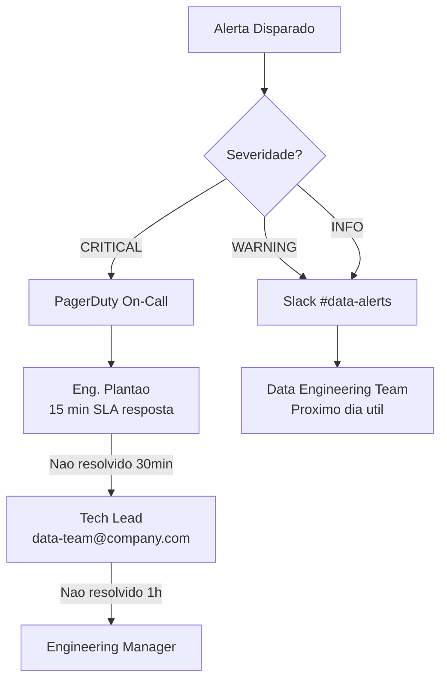

# FX Data Platform — Operational Runbook

> For each incident scenario: **Sintoma → Diagnostico → Resolucao → Prevencao**

---

## Table of Contents

- [a) Pipeline ETL falhando](#a-pipeline-etl-falhando)
- [b) Consumer lag crescendo no Redpanda](#b-consumer-lag-crescendo-no-redpanda)
- [c) Debezium parou de capturar CDC](#c-debezium-parou-de-capturar-cdc)
- [d) Modelo de ML com drift detectado](#d-modelo-de-ml-com-drift-detectado)
- [e) Tabela Iceberg corrompida](#e-tabela-iceberg-corrompida)
- [f) S3 bucket ficou inacessivel](#f-s3-bucket-ficou-inacessivel)
- [g) Airflow DAG travada](#g-airflow-dag-travada)
- [h) Servico de inferencia com latencia alta](#h-servico-de-inferencia-com-latencia-alta)
- [Escalation Path](#escalation-path)
- [Maintenance Silencing](#maintenance-silencing)

---

## a) Pipeline ETL falhando

### Sintoma
- Alerta Airflow: task `bronze_ingest`, `silver_transform` ou `gold_aggregate` marcada como `failed`
- Dados na camada Gold nao atualizados (freshness > SLA de 2h)
- Dashboard "Pipeline Health" no Grafana mostra status vermelho

### Diagnostico

```bash
# 1. Verificar qual task falhou no Airflow
curl -s http://localhost:8090/api/v1/dags/dag_daily_etl/dagRuns | python -m json.tool

# 2. Ver logs da task falhada
docker compose logs airflow --tail 200 | grep -i "error\|exception\|failed"

# 3. Verificar se dados raw existem para a data
docker compose exec minio mc ls local/fx-datalake-raw/events/event_date=$(date +%Y-%m-%d)/

# 4. Verificar se Spark consegue acessar MinIO
docker compose exec airflow spark-submit --version

# 5. Verificar espaco em disco
df -h
docker system df
```

### Resolucao

```bash
# 1. Se dados raw faltando — verificar ingestao (ver cenario b/c)

# 2. Se Spark falhou — verificar logs e reprocessar
python scripts/ops/reprocess_partition.py \
  --layer bronze \
  --start $(date +%Y-%m-%d) \
  --end $(date +%Y-%m-%d) \
  --execute

# 3. Se problema de schema — verificar evolucao
# Iceberg suporta schema evolution, mas o job Spark pode ter
# StructType incompativel. Verificar etl/common/schemas.py

# 4. Se problema de memoria — ajustar Spark configs
# Em conf/spark-defaults.conf:
# spark.driver.memory 4g
# spark.executor.memory 4g

# 5. Rerun manual da DAG no Airflow
curl -X POST http://localhost:8090/api/v1/dags/dag_daily_etl/dagRuns \
  -H "Content-Type: application/json" \
  -d '{"conf": {"date": "'$(date +%Y-%m-%d)'"}}' \
  -u admin:admin
```

### Prevencao
- SLA de 2h configurado na DAG com `on_sla_miss_callback`
- Quality checks entre cada camada detectam problemas antes de propagar
- Retries configurados: 2 tentativas com backoff exponencial
- Manutencao Iceberg diaria (expire snapshots, compaction) evita small file problem

---

## b) Consumer lag crescendo no Redpanda

### Sintoma
- Alerta `HighConsumerLag`: lag > 10.000 mensagens por mais de 5 minutos
- Dashboard "Consumer Lag por Consumer Group" no Grafana subindo
- Dados na camada Raw ficando atrasados

### Diagnostico

```bash
# 1. Listar consumer groups e ver lag
docker compose exec redpanda rpk group list
docker compose exec redpanda rpk group describe <consumer-group-name>

# 2. Verificar se Redpanda Connect esta rodando
docker compose ps redpanda-connect

# 3. Ver logs do consumer
docker compose logs redpanda-connect --tail 200

# 4. Verificar throughput dos topicos
docker compose exec redpanda rpk topic describe fx.transactions

# 5. Verificar se MinIO esta aceitando writes (sink)
curl -s http://localhost:9000/minio/health/live
```

### Resolucao

```bash
# 1. Se Redpanda Connect crashou — reiniciar
docker compose restart redpanda-connect

# 2. Se lag por burst de dados — aumentar batch size
# Editar redpanda-connect/pipeline.yaml:
# batching.count: 500 (era 100)
# batching.period: 30s (era 10s)
docker compose restart redpanda-connect

# 3. Se MinIO lento — verificar disco e reiniciar
docker compose restart minio

# 4. Se consumer travado — resetar offset (CUIDADO: pode perder msgs)
docker compose exec redpanda rpk group seek <group> --to end
# Ou para reprocessar desde um ponto:
docker compose exec redpanda rpk group seek <group> --to start

# 5. Se throughput excede capacidade — verificar producer rate
# Reduzir rate do streaming producer temporariamente
```

### Prevencao
- Monitorar tendencia de lag no dashboard antes de atingir threshold
- Alertas graduais: warning em 5.000, critical em 10.000
- Dead letter queue para mensagens que falham processamento
- Auto-scaling de consumers em producao (ECS/K8s)

---

## c) Debezium parou de capturar CDC

### Sintoma
- Topico `fx.public.transactions` no Redpanda sem novas mensagens
- Alerta `NoDataIngestion` disparado
- Dados no PostgreSQL continuam sendo inseridos mas nao chegam ao Redpanda

### Diagnostico

```bash
# 1. Verificar status do conector Debezium
curl -s http://localhost:8083/connectors/fx-cdc-connector/status | python -m json.tool

# 2. Verificar replication slot no PostgreSQL
docker compose exec postgres psql -U postgres -d fx_transactions -c \
  "SELECT * FROM pg_replication_slots;"

# 3. Verificar WAL retention
docker compose exec postgres psql -U postgres -c \
  "SELECT pg_current_wal_lsn(), pg_wal_lsn_diff(pg_current_wal_lsn(), confirmed_flush_lsn) as lag_bytes FROM pg_replication_slots WHERE slot_name = 'fx_cdc_slot';"

# 4. Verificar logs do Debezium/Kafka Connect
docker compose logs debezium --tail 200

# 5. Verificar se heartbeat esta funcionando
docker compose exec redpanda rpk topic consume __debezium-heartbeat --num 1
```

### Resolucao

```bash
# 1. Se conector em estado FAILED — reiniciar
curl -X POST http://localhost:8083/connectors/fx-cdc-connector/restart

# 2. Se replication slot nao existe — recriar
docker compose exec postgres psql -U postgres -d fx_transactions -c \
  "SELECT pg_create_logical_replication_slot('fx_cdc_slot', 'pgoutput');"

# 3. Se WAL acumulou demais — limpar e reiniciar com snapshot
curl -X DELETE http://localhost:8083/connectors/fx-cdc-connector
# Editar connector-config.json: "snapshot.mode": "initial"
bash ingestion/debezium/register-connector.sh

# 4. Se PostgreSQL atingiu max_wal_size — aumentar
docker compose exec postgres psql -U postgres -c \
  "ALTER SYSTEM SET max_wal_size = '2GB';"
docker compose restart postgres

# 5. Verificar que CDC voltou a funcionar
docker compose exec redpanda rpk topic consume fx.public.transactions --num 1
```

### Prevencao
- Heartbeat configurado a cada 10s para manter slot ativo
- Monitorar tamanho do WAL e lag do slot
- Publication explicita no PostgreSQL para controlar quais tabelas
- Alertas de connector status via dag_streaming_monitor (a cada 15min)

---

## d) Modelo de ML com drift detectado

### Sintoma
- Alerta `DataDriftDetected`: PSI > 0.2 em uma ou mais features
- Alerta `ModelStaleness`: modelo em producao ha > 30 dias
- Dashboard "Data Drift Detection (PSI)" no Grafana mostrando features em vermelho
- Possivel degradacao de precision/recall do modelo

### Diagnostico

```bash
# 1. Verificar quais features driftaram
curl -s http://localhost:8000/metrics | grep fx_feature_drift_psi

# 2. Rodar validacao de features
python -m ml.feature_store.scripts.validate_features --env dev

# 3. Verificar distribuicao atual vs referencia
# Acessar MLflow: http://localhost:5000
# Comparar metricas do run mais recente com baseline

# 4. Verificar se drift e por mudanca nos dados de origem
python scripts/ops/data_quality_report.py --env dev --days 7

# 5. Verificar versao do modelo em producao
curl -s http://localhost:8000/health | python -m json.tool
```

### Resolucao

```bash
# 1. Avaliar se drift e esperado (sazonalidade, novo produto, campanha)
# Se sim — atualizar dataset de referencia e retreinar

# 2. Retreinar modelo
python -m ml.training.train_anomaly_detector \
  --config ml/config/training_config.yaml \
  --env dev

# 3. Avaliar novo modelo vs atual
python -m ml.training.evaluate_model --env dev

# 4. Promover para staging e validar
python -m ml.training.promote_model --env dev

# 5. Verificar que inference service carregou nova versao
# (hot reload automatico a cada 5 min)
curl -s http://localhost:8000/health | python -m json.tool

# 6. Monitorar PSI apos retreino — deve normalizar
```

### Prevencao
- Pipeline de retreino semanal automatico (dag_ml_pipeline - segunda 08:00 UTC)
- PSI monitorado continuamente no dashboard
- Threshold de alerta em PSI > 0.2 com 15min de persistencia
- Feature validation apos cada materializacao do Feast

---

## e) Tabela Iceberg corrompida

### Sintoma
- Spark job falha com `NotFoundException`, `CorruptedTableException` ou `Cannot find snapshot`
- Queries retornam resultados inconsistentes ou zero rows
- Metadata files ausentes no S3/MinIO

### Diagnostico

```bash
# 1. Verificar metadata da tabela
spark-sql -e "DESCRIBE EXTENDED bronze.transactions"

# 2. Listar snapshots
spark-sql -e "SELECT * FROM bronze.transactions.snapshots ORDER BY committed_at DESC LIMIT 10"

# 3. Verificar se arquivos de dados existem
docker compose exec minio mc ls local/fx-datalake-bronze/transactions/

# 4. Verificar manifests
spark-sql -e "SELECT * FROM bronze.transactions.manifests"

# 5. Verificar orphan files
python scripts/ops/cleanup_orphan_files.py --env dev --bucket fx-datalake-bronze
```

### Resolucao

```bash
# 1. Rollback para snapshot anterior (se snapshot valido existe)
spark-sql -e "CALL bronze.system.rollback_to_snapshot('transactions', <snapshot_id>)"

# 2. Se nenhum snapshot valido — recriar tabela
python -m etl.iceberg.catalog_setup --env dev
# Reprocessar dados desde raw
python scripts/ops/reprocess_partition.py \
  --layer bronze --start 2024-01-01 --end $(date +%Y-%m-%d) --execute

# 3. Limpar arquivos orfaos apos recuperacao
spark-sql -e "CALL bronze.system.remove_orphan_files(table => 'transactions', older_than => TIMESTAMP '$(date +%Y-%m-%d) 00:00:00')"

# 4. Rodar compaction para consolidar small files
spark-sql -e "CALL bronze.system.rewrite_data_files(table => 'transactions')"

# 5. Validar integridade apos recuperacao
spark-sql -e "SELECT COUNT(*), MIN(event_date), MAX(event_date) FROM bronze.transactions"
```

### Prevencao
- Manutencao diaria Iceberg via dag_daily_etl (task `iceberg_maintenance`)
- Expire snapshots mantendo ultimos 7 dias
- Backup periodico de metadata para S3 separado
- Nunca deletar arquivos manualmente — usar `cleanup_orphan_files.py --dry-run` primeiro

---

## f) S3 bucket ficou inacessivel

### Sintoma
- Spark jobs falham com `NoSuchBucket`, `AccessDenied` ou `Connection refused`
- Redpanda Connect nao consegue gravar no raw
- MinIO console inacessivel em localhost:9001

### Diagnostico

```bash
# 1. Verificar se MinIO esta rodando
docker compose ps minio

# 2. Verificar health
curl -s http://localhost:9000/minio/health/live

# 3. Verificar credenciais
docker compose exec minio mc alias set local http://localhost:9000 minioadmin minioadmin
docker compose exec minio mc ls local/

# 4. Verificar espaco em disco do volume
docker system df -v | grep minio

# 5. Em AWS — verificar IAM permissions
aws sts get-caller-identity
aws s3 ls s3://fx-datalake-bronze/ --region us-east-1
```

### Resolucao

```bash
# 1. Se MinIO down — reiniciar
docker compose restart minio

# 2. Se buckets foram deletados — recriar
docker compose exec minio mc mb local/fx-datalake-raw
docker compose exec minio mc mb local/fx-datalake-bronze
docker compose exec minio mc mb local/fx-datalake-silver
docker compose exec minio mc mb local/fx-datalake-gold
docker compose exec minio mc mb local/fx-datalake-ml

# 3. Se disco cheio — limpar
docker system prune -f
python scripts/ops/cleanup_orphan_files.py --env dev --execute

# 4. Se problema de permissao em AWS — verificar IAM role
aws iam get-role --role-name fx-datalake-glue-role
aws iam list-attached-role-policies --role-name fx-datalake-glue-role

# 5. Se tudo perdido — reset completo (CUIDADO: perde dados)
# make reset
```

### Prevencao
- Versionamento habilitado em todos os buckets S3
- Lifecycle policy: raw → Glacier apos 90 dias
- Monitorar uso de disco no dashboard "Cost Tracking"
- Block public access em todos os buckets
- IAM roles com least privilege (modulos Terraform)

---

## g) Airflow DAG travada

### Sintoma
- DAG em estado `running` mas sem progresso ha mais de o SLA (2h para ETL)
- Tasks em estado `queued` ou `up_for_retry` indefinidamente
- Alerta de SLA miss disparado

### Diagnostico

```bash
# 1. Verificar DAG runs
curl -s http://localhost:8090/api/v1/dags/dag_daily_etl/dagRuns \
  -u admin:admin | python -m json.tool

# 2. Verificar task instances
curl -s "http://localhost:8090/api/v1/dags/dag_daily_etl/dagRuns/$(date +%Y-%m-%d)/taskInstances" \
  -u admin:admin | python -m json.tool

# 3. Verificar logs do scheduler
docker compose logs airflow --tail 200 | grep -i "scheduler\|deadlock\|stuck"

# 4. Verificar se PostgreSQL (metadb) esta acessivel
docker compose exec postgres psql -U postgres -d airflow -c "SELECT COUNT(*) FROM task_instance WHERE state = 'running';"

# 5. Verificar recursos do container
docker stats fx-airflow --no-stream
```

### Resolucao

```bash
# 1. Se task stuck — marcar como failed para retry
curl -X PATCH "http://localhost:8090/api/v1/dags/dag_daily_etl/dagRuns/<run_id>/taskInstances/<task_id>" \
  -H "Content-Type: application/json" \
  -d '{"new_state": "failed"}' \
  -u admin:admin

# 2. Se scheduler travou — reiniciar
docker compose restart airflow

# 3. Se pool exauriu — verificar e limpar
docker compose exec airflow airflow pools list
docker compose exec airflow airflow pools set default_pool 128 "Default pool"

# 4. Se dead lock no metadb — clear task instances
docker compose exec airflow airflow tasks clear dag_daily_etl -s $(date +%Y-%m-%d) -e $(date +%Y-%m-%d)

# 5. Se DAG inteira travada — clear dag run
docker compose exec airflow airflow dags backfill dag_daily_etl -s $(date +%Y-%m-%d) -e $(date +%Y-%m-%d) --reset-dagruns
```

### Prevencao
- `max_active_runs=1` nas DAGs para evitar concorrencia
- SLA de 2h com callback automatico
- Retries com exponential backoff (2 tentativas)
- Health check do scheduler no dag_streaming_monitor
- Catchup=False para nao acumular runs atrasadas

---

## h) Servico de inferencia com latencia alta

### Sintoma
- Alerta `InferenceServiceCritical`: p95 > 500ms (ou warning em >100ms)
- Dashboard "Prediction Latency" no Grafana mostrando spikes
- Aplicacoes dependentes reportando timeouts

### Diagnostico

```bash
# 1. Verificar health e metricas
curl -s http://localhost:8000/health | python -m json.tool
curl -s http://localhost:8000/metrics | grep latency

# 2. Verificar se modelo esta carregado
curl -s http://localhost:8000/health | grep model_loaded

# 3. Verificar recursos do container
docker stats fx-inference-service --no-stream

# 4. Verificar Feast online store (maior fonte de latencia)
curl -s http://localhost:8000/metrics | grep feast

# 5. Rodar load test para medir baseline
python ml/serving/scripts/load_test.py --duration 60

# 6. Verificar logs por erros
docker compose logs inference-service --tail 100 | grep -i "error\|slow\|timeout"
```

### Resolucao

```bash
# 1. Se modelo nao carregado — reiniciar servico
docker compose restart inference-service

# 2. Se Feast lento — verificar online store
# Em dev, Feast usa SQLite que pode ser lento
# Verificar se feature materialization esta recente

# 3. Se CPU alta — pode ser modelo grande ou burst de requests
# Verificar se modelo correto esta carregado (nao um debug model)
curl -s http://localhost:8000/health | grep model_version

# 4. Se memoria alta — possivel leak, reiniciar
docker compose restart inference-service

# 5. Se problema persistente — verificar se modelo precisa otimizacao
# Modelo muito grande → considerar quantizacao ou feature reduction
# Latencia de rede → verificar se Feast esta no mesmo network

# 6. Em producao — escalar horizontalmente
# Adicionar replicas no ECS/K8s
```

### Prevencao
- Load test automatico apos cada deploy de modelo
- Latencia monitorada com histograma Prometheus (p50, p95, p99)
- Model loader com fallback para versao anterior se nova falhar
- Hot reload sem downtime (background thread verifica a cada 5min)
- Feature caching local para reduzir chamadas ao Feast

---

## Escalation Path



| Tier | Quem | Responsabilidade | Contato |
|------|------|------------------|---------|
| Tier 1 | Engenheiro de plantao | Disponibilidade, restart de servicos, lag < 5k | PagerDuty |
| Tier 2 | Data Engineering Team | Quality issues, ETL tuning, Spark optimization | Slack #data-platform |
| Tier 3 | ML Team | Model drift, retraining, feature engineering | Slack #ml-team |

---

## Maintenance Silencing

Para silenciar alertas durante manutencao planejada:

```bash
# Criar silence no AlertManager (2 horas)
curl -X POST http://localhost:9093/api/v2/silences \
  -H "Content-Type: application/json" \
  -d '{
    "matchers": [{"name": "alertname", "value": ".*", "isRegex": true}],
    "startsAt": "'$(date -u +%Y-%m-%dT%H:%M:%S)'Z",
    "endsAt": "'$(date -u -d '+2 hours' +%Y-%m-%dT%H:%M:%S)'Z",
    "createdBy": "ops-team",
    "comment": "Manutencao planejada"
  }'

# Listar silences ativos
curl -s http://localhost:9093/api/v2/silences | python -m json.tool

# Remover silence
curl -X DELETE http://localhost:9093/api/v2/silence/<silence-id>
```

---

**Auto-generated runbook available at:** `python scripts/ops/generate_runbook.py --output docs/runbook_generated.md`

**Last Updated:** March 2026
**Next Review:** April 2026
